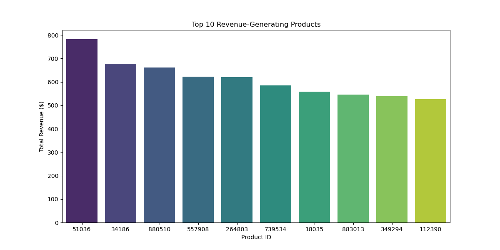
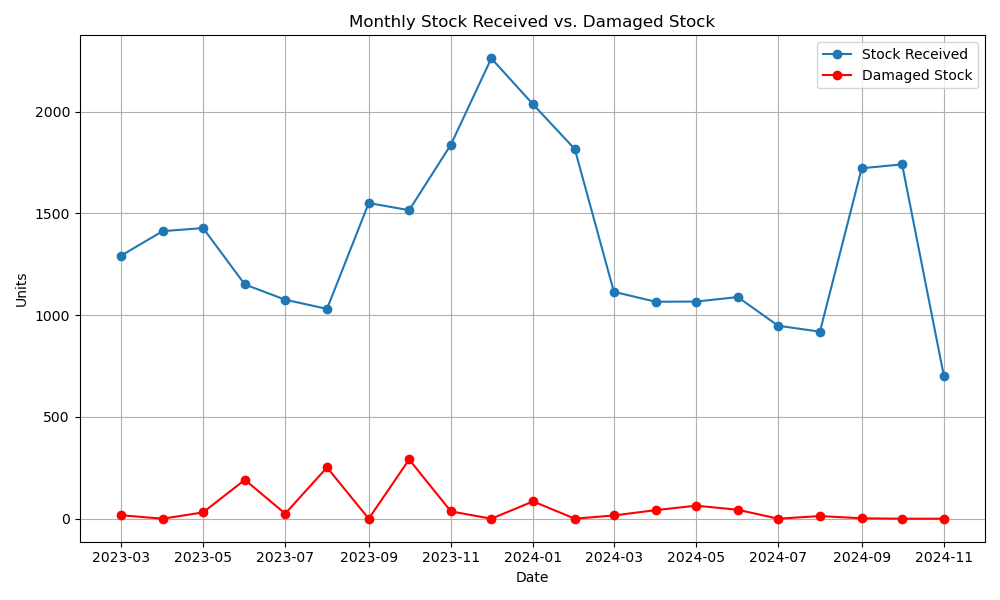
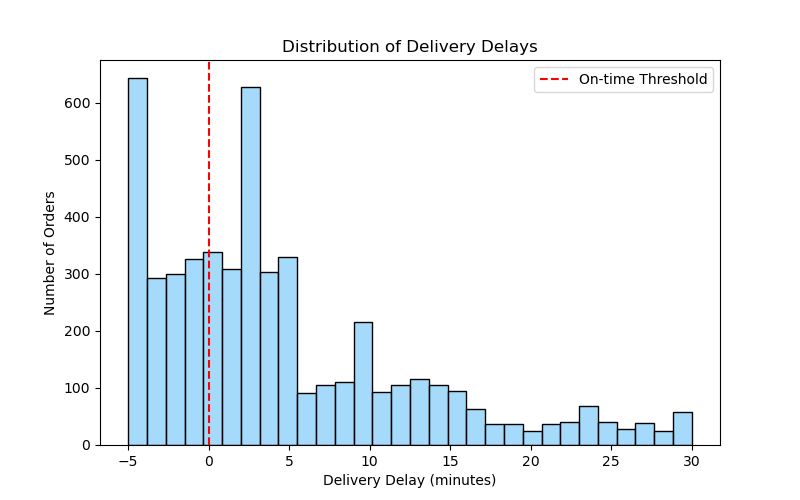
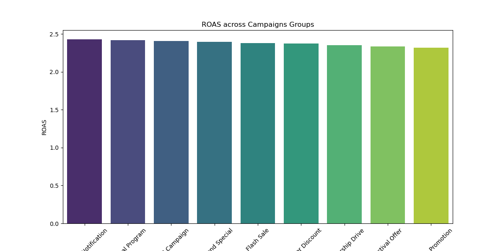
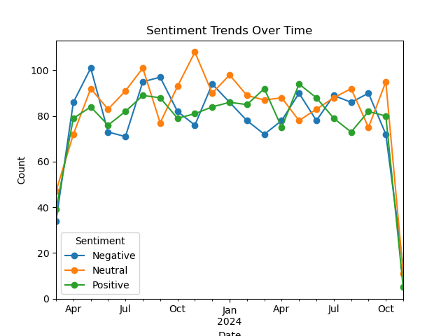

# Blinkit Sales Analysis

## ⭐ Purpose:
My analysis aims to explore performance trends across Blinkit's product catalog, marketing campaigns, customer behavior, and delivery logistics data of the Blinkit service. By leveraging Python and its many libraries, I will uncover actionable insights that inform business decisions in areas such as campaign optimization, customer satisfaction, and operational efficiency.

## 📊 Dataset Description:
Blinkit is an online grocery delivery service based in India. In beginning my analysis, I converted all prices from the Indian Rupee to the United States Dollar for familiarity purposes. The exchange rate used is current as of March 2025. The original Blinkit Sales dataset consists of 9 different CSV files containing information in different categories such as products, deliveries, and customers. Two of the files were excluded from my analysis `blinkit_order_items.csv` and `blinkit_inventory.csv`. These files were either redundant or a new, updated version of the file was available. The files included in my analysis are as follows:
- `blinkit_inventory.csv` and `blinkit_order_items.csv` — Order-level data including product, quantity, and sales
- `blinkit_delivery_performance.csv` and `blinkit_customers.csv`— Delivery metrics and customer details pertaining to orders and location
- `blinkit_inventoryNew.csv` — Inventory stock data including damaged stock
- `blinkit_marketing_performance.csv` and `blinkit_customer_feedback.csv` — Marketing metrics and customer feedback

The complete and original dataset can be previewed and downloaded here: https://www.kaggle.com/datasets/akxiit/blinkit-sales-dataset/data.

## 🚩 Challenges and Limitations:
- There is a lack of variability in the number of orders placed at each store and deliveries made by each partner. Across the board the values for both of these instances are 1 or 0, leaving analysis of stores or partners who are experiencing frequent delivery issues or successes up in the air. Either a store had a late delivery or they did not. All stores only received 1 order, and all partners delivered only one order.

## 🛠 Tools and Technologies:
- Python Libraries: Pandas, NumPy, Matplotlib, Seaborn.
- Jupyter Notebook and VS Studio: Code execution and analysis.

## 💡 Business Insights and Recommendations:

### 1. Product Pricing and Margins
- The **average product price** is **$5.86**, and the **average margin** is **27.77%**.
- Categories with the highest margins:
  - *Instant & Frozen Food (40%)*
  - *Personal Care (35%)*
  - *Pet Care (35%)*
  - *Snacks & Munchies (35%)*
- The lowest-margin category is *Fruits & Vegetables*.

 **✅ Recommendation:**\
  Target promotions towards high-margin categories to maximize profits. Re-evaluate pricing or sourcing strategies for products in the lower-margin categories.

---
### 2. Product Popularity vs. Revenue

*Top products by total revenue — note that not all highly ordered items are high earners.*

- The most frequently ordered items and the items generating the most revenue do not fully overlap
- Product_id `51036` is a strong performer, appearing at the top for order frequency and revenue generation
- Some of the most ordered products generate lower revenue, suggesting low prices or margins

 **✅ Recommendation:**\
  Prioritize marketing for products that are both high-frequency and high-revenue. Review pricing or bundling strategies for high-volume but low-revenue items.

---
### 3. Order Value and Size
- **Average order value** is **$11.73**.
- Customers typically purchase **2 items** per order, with low variance

 **✅ Recommendation:**\
  Introduce offers like 'buy 2, get 1 free' or small discounts for orders containing 3+ items to increase average order size and value.
  
---
### 4. Inventory Loss

*Comparison of inventory received vs damaged over time.*

- Highest rates of overall damaged stock received occurred in:
  - *August 2023 (24.4%)*
  - *October 2023 (19.2%)*
  - *June 2023 (16.6%)*
- Frequently damaged products include:
  - *`124290` (12.26%)*
  - *`317242`, `661577`, `897083`, etc. (above 8%)*
 
   **✅ Recommendation:**\
  Investigate packaging, handling, or supplier practices during high-damage months. Apply quality checks or consider different suppliers for persistently damaged SKUs.

---
### 5. Delivery Performance and Customer Ordering Behavior
 \
*Histogram showing variation in delivery durations across all orders.*

- **61.96% of deliveries were late**
- **Average delivery time** across all orders: **4.44 minutes**
- **On-time orders** average only **2.47 minutes**
- There is no observed correlation between order total and delivery speed

 **✅ Recommendation (Limited due to little variation in store and employee delivery data):**\
 Conduct root-cause analysis on logistics delays. Consider:
 - Revising delivery staff scheduling/coverage
 - Adjusting ETA shown to customers
 - Optimize routes for high-traffic areas
Though all customers deserve fast delivery, consider premium delivery perks for ** loyal or high-spend customers** to increase satisfaction and retention.

---
### 6. Customer Spending and Order Frequency
- **Average total spend per customer: $26.31**
- **Spending varies widely**, typically by about $11.99 above or below the average spend
- **Customers place an average of 2.3 orders**
- **Top customers placed a similar number of orders**. The top customer placed 9 orders, followed by two customers placing 8, and many others placing 7.

 **✅ Recommendation:**\
 Identify top repeat customers and offer **exclusive deals or early access** promotions. These users are beneficial for word-of-mouth marketing and retention.
 Segment customers by spending tiers. Develop personalized marketing for:
 - High-frequency buyers (loyalty program or tiered rewards)
 - Low-spend customers (incentives to re-engage with the service)

---
### 7. Marketing Performance
#### 7a. Marketing Metrics Relationship is Non-Linear
- A heatmap of impressions, clicks, conversions, spend, and revenue shows **weak linear correlation**
- This suggests **non-linear behavior** such as **diminishing returns** and complex audience responses

 **✅ Recommendations:**\
 Use non-linear modeling techniques to uncover more accurate patterns. Consider A/B testing budget increments to identify points where performance levels out.

#### 7b. ROAS across Campaign Groups are Fairly Even

*Average ROAS comparison across different campaign strategies.*

- ROAS is relatively even across campaigns, channels, and target audiences with little variation
- Email campaigns show strongest ROAS
- **Highest ROAS Campaign:** ID `664981`(Email to New Users via Social Media) with **ROAS of 4.0**
- **Top Average ROAS across campaign groups:**
  - *Email (2.78)*
  - *Festival Offer (2.77)*
  - *App Push Notification (2.76)*

 **✅ Recommendation:**\
 Prioritize **Email and Push Notifications** in upcoming campaigns. Analyze what made campaign `664981` successful and replicate its audience/message mix.

#### 7c. Budget Efficiency
- **Category Promotions** had the **highest ad spend at $22,206.99**, but the **lowest average ROAS (2.69)**.
- App Push notifications had the **lowest spend**, but one of the **highest average ROAS** values.

 **✅ Recommendation:**\
**Reallocate budget** from underperforming campaign types to those with better ROAS.

#### 7d. 67.81% of Campaigns are Underperforming
- **3662 out of 5400 campaigns** are **underperforming** (based on the average ROAS).
- Despite large-scale efforts, the majority of campaigns fail to convert efficiently.

 **✅ Recommendation:**\
 Consider implementing **automated performance monitoring**. Set benchmarks to pause or tweak underperforming campaigns early and focus spending on proven formats/audience mixes.

#### 7e. ROAS across Channels is uniform, But Engagement Varies
- Average ROAS is nearly identical across channel types, (App, Social Media, Email are ~2.75, SMS is at 2.71)
- **Engagement Rate** is highest for:
  - *Email (14.85%)*
  - *SMS (14.27%)*
  - **Click-Through Rate (CTR)** follows a similar trend

 **✅ Recommendation:**\
 Even though ROAS is flat, Email and SMS may offer **better engagement leverage**. Test deeper segmentation or personalization for high-engagement channels.

 #### 7f. Audience Groups Perform Similarly
 - ROAS by audience:
   - *All (2.77)*
   - *New Users (2.75)*
   - *Premium (2.74)*
   - *Inactive (2.70)*
- Conversion rates and CTR are also close across segments.

 **✅ Recommendation:**\
 Focus audience optimization not on **broad segments** but on **micro-behaviors** (past order timing, product category interest, churn risk, etc.).

 #### 7g. Weekly Patterns Reveal Performance Opportunities
 - **Saturday** has highest conversions (44,829 total), average conversions (57.92), and total engagement.
 - **Sunday** has highest average ROAS (2.77).
 - **Wednesday** has lowest average engagement and conversion rate.

 **✅ Recommendation:**\
 Launch high-priority campaigns and promotions on **weekends**. Use lower-performing days (Wednesday) to do testing and low-stake efforts.

 #### 7h. Daily Performance is Stable with Seasonal Variance
 - ROAS and conversions are **evenly distributed** over time, with the exception of:
   - *A large peak and subsequent dip around **Nov 2023**
   - *Greater variance in H2 of 2024 (higher highs, lower lows)
  
 **✅ Recommendation:**\
 Investigate campaign/event schedules for the late 2023 spike and drop. Increase monitoring during **seasonally volatile periods** for adaptive budgeting.

 ---
 ### 8. Customer Feedback
 
 #### 8a. Customer Ratings are Moderate
- **Average customer rating:** 3.34 out of 5
- **Standard Deviation** is 1.19, indicating mixed satisfaction levels
- Average ratings by category:
  - *Customer Service: 3.37*
  - *App Experience: 3.36*
  - *Delivery: 3.33*
  - *Product Quality: 3.32*

 **✅ Recommendation:**\
 Monitor shifts in average rating over time. Target the **lowest-rated categories (product quality and delivery)** for improvement initiatives — such as packaging revisions, delivery partner audits, or item descriptions.

#### 8b. Sentiment Distribution is Evenly Split
 \
*Monthly trend of customer sentiment reveals shifting satisfaction levels.*

- Sentiment Breakdown:
  - *Neutral: 34.76%*
  - *Negative: 32.84%*
  - *Positive: 32.40%*
 
 **✅ Recommendation:**\
Because negative sentiment is nearly equal to positive, focus on **closing the gap** by identifying common customer pain points and systematically addressing them through operations and messaging.

#### 8c. Top Causes of Negative Feedback Identified
- Most common reasons customers leave negative feedback:
  - *Late deliveries*
  - *Damaged products*
  - *Perceived overpricing or poor product quality*
  - *Receiving the wrong item*
 
 **✅ Recommendation:**\
Route complaint categories directly to responsible teams (logistics, inventory, etc).
Introduce a feature in the platform that allows customers to tag complaints by reason, improving resolution speed.

---
## 📌 Overall Recommendations Summary

| Area            | Key Action                                                        |
|-----------------|-------------------------------------------------------------------|
| Product         | Prioritize high-margin SKUs, re-evaluate low-revenue top sellers  |
| Inventory       | Reduce damage through supplier reviews and packaging updates      |
| Delivery        | Optimize timing and routing, reward frequent buyers               |
| Marketing       | Reallocate ad spend, test micro-targeting and weekend boosts      |
| Feedback        | Address logistics and quality complaints with real-time triage    |
