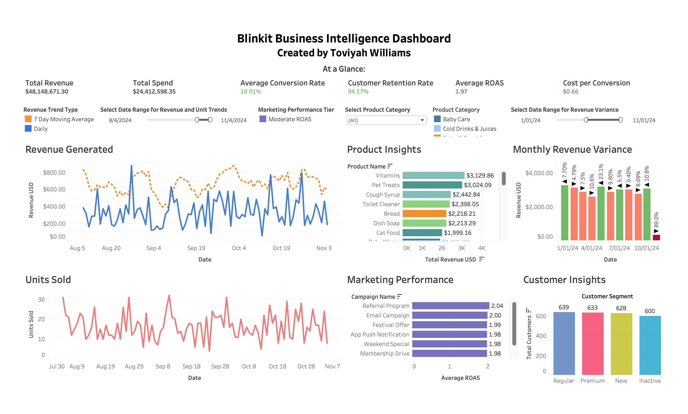

# Blinkit Sales Analysis

## ⭐ Purpose:
My analysis aims to explore performance trends across Blinkit's product catalog, marketing campaigns, customer behavior, and delivery logistics data of the Blinkit service. By leveraging Python and its many libraries, I will uncover actionable insights that inform business decisions in areas such as campaign optimization, customer satisfaction, and operational efficiency.

## 📊 Dataset Description:
Blinkit is an online grocery delivery service based in India. In beginning my analysis, I converted all prices from the Indian Rupee to the United States Dollar for familiarity purposes. The exchange rate used is current as of March 2025. The original Blinkit Sales dataset consists of 9 different CSV files containing information in different categories such as products, deliveries, and customers. Two of the files were excluded from my analysis `blinkit_order_items.csv` and `blinkit_inventory.csv`. These files were either redundant or a new, updated version of the file was available. The files included in my analysis are as follows:
- `blinkit_inventory.csv` and `blinkit_order_items.csv` — Order-level data including product, quantity, and sales
- `blinkit_delivery_performance.csv` and `blinkit_customers.csv`— Delivery metrics and customer details pertaining to orders and location
- `blinkit_inventoryNew.csv` — Inventory stock data including damaged stock
- `blinkit_marketing_performance.csv` and `blinkit_customer_feedback.csv` — Marketing metrics and customer feedback

The complete and original dataset can be previewed and downloaded here: https://www.kaggle.com/datasets/akxiit/blinkit-sales-dataset/data.

## 🛠 Tools and Technologies:
- Tools: Python, PostgreSQL, Tableau, VS Studio, PgAdmin4
- Libraries: Pandas, NumPy, Matplotlib, Seaborn.

## 🖥️ Tableau Dashboard:

*[Click Here to View Interactive Dashboard](https://public.tableau.com/views/BlinkitSalesAnalysisBIDashboard/BIDashboard?:language=en-US&:sid=&:redirect=auth&:display_count=n&:origin=viz_share_link)*

## 💡 Business Insights and Recommendations:
Read up on my analysis and methods in-depth in the **Business Intelligence Report File**.

**Key Insights:**
- Although the average ROAS exceeded 2.0, several campaigns delivered poor returns—especially visible through unweighted ROAS calculations.
- Conversion rates and ROAS were generally consistent across channels and audiences, indicating flat engagement that may hide micro-segment opportunities.
- A clear gap exists between MRP and actual selling prices, especially in lower-cost categories, which could be optimized to increase profitability.
- Inventory restocking events were unevenly distributed across weekdays and months, suggesting inefficiencies in supply chain timing.
- Most frequent negative feedback terms included “delivery,” “late,” “damaged,” and “price”—suggesting recurring friction in fulfillment and value perception.

**Key Recommendations:**
- Consider implementing automated performance monitoring. Set benchmarks to pause or tweak underperforming campaigns early and focus spending on proven formats/audience mixes. Monitor campaign effectiveness weekly via views and dashboards.
- Reallocate marketing budget from broad, underperforming campaigns to niche, high-ROAS audiences determined through customer segment restructuring. 
- Focus audience optimization not on broad segments but on micro-behaviors (past order timing, product category interest, churn risk, etc.).
- Improve delivery partner monitoring by tracking average delays by store/partner ID.
- Set sentiment alerts for flagged keywords in customer feedback to proactively manage customer experience.
- Even out restocking cadence to reduce operational strain and avoid overstocking or stockouts; base timing on historical demand patterns.

## 🚩 Limitations:
- I encountered challenges and limitations in the data while conducting my analysis. What these are, as well as what action I took, are **outlined in the Business Intelligence Report File**.
